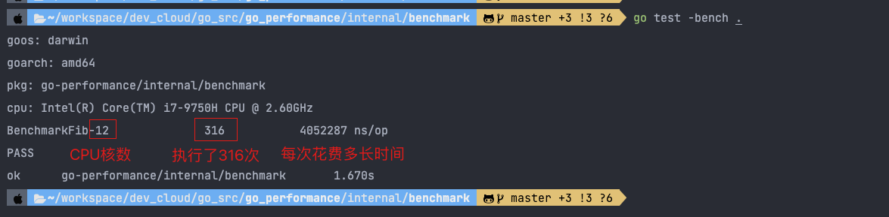
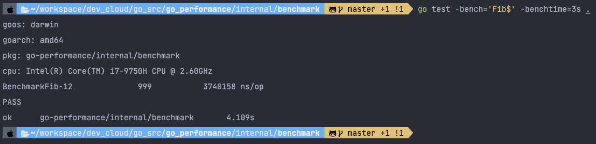
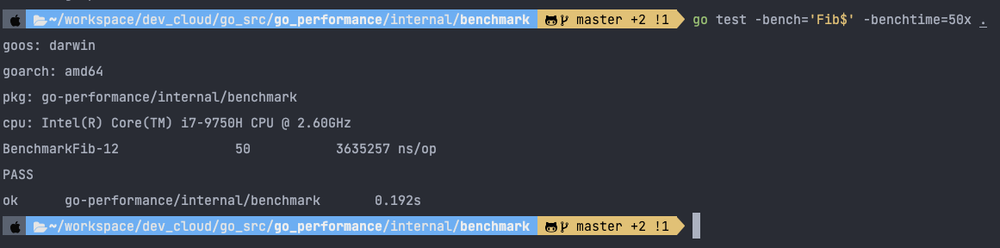
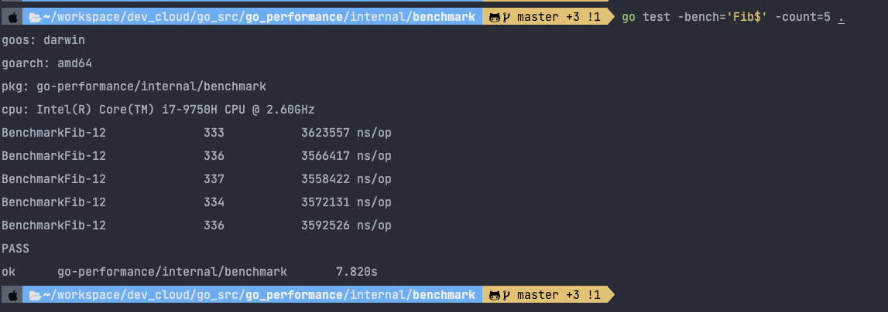
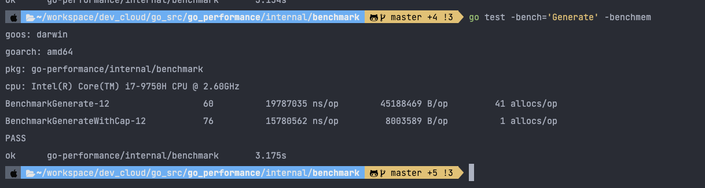
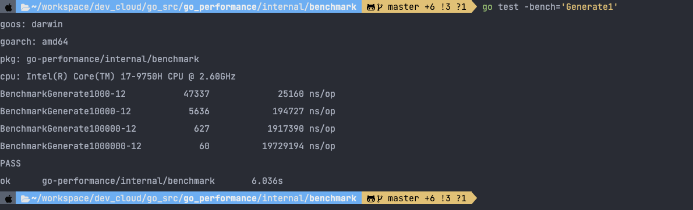
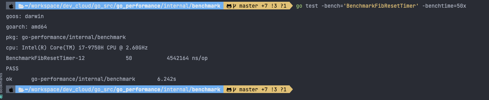
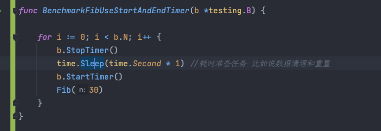

benchmark 的默认时间是 1s，那么我们可以使用 -benchtime 指定为 3s

-benchtime 的值除了是时间外，还可以是具体的执行次数。

-count 参数可以用来设置benchmark的轮数。

使用 -benchmem 参数看到内存分配的情况 Generate 分配的内存是 GenerateWithCap 的 6 倍，设置了切片容量，内存只分配一次，而不设置切片容量，内存分配了 40 次。 GenerateWithCap 的耗时比
Generate 少 20%。

复杂读观察 输入变为原来的 10 倍，函数每次调用的时长也差不多是原来的 10 倍 O(n)

通过b.ResetTimer() 将数据准备的代码耗时忽略掉。

通过 StopTimer & StartTimer 将数据准备/清理的代码耗时忽略掉。

