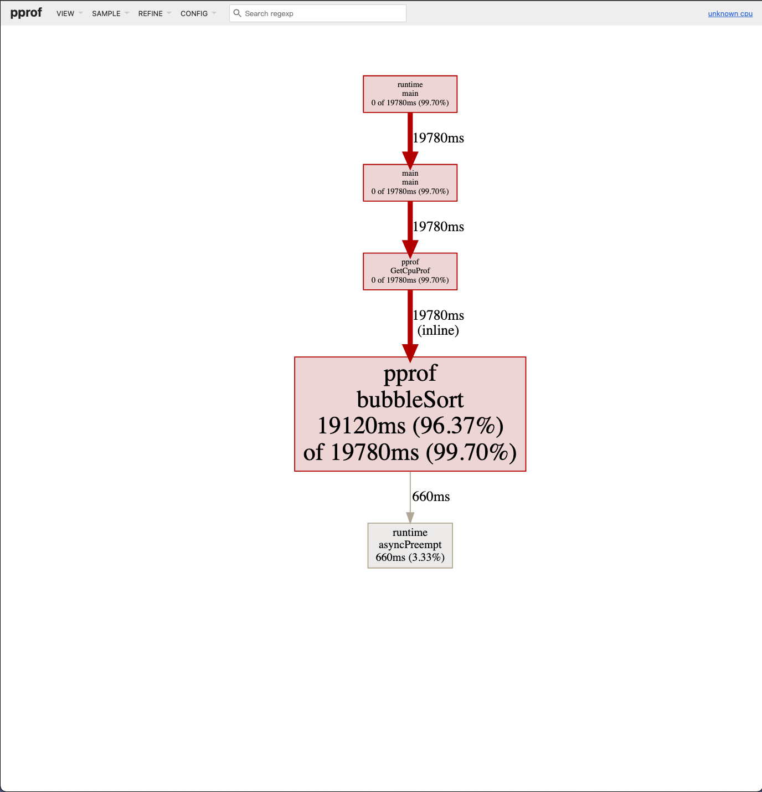
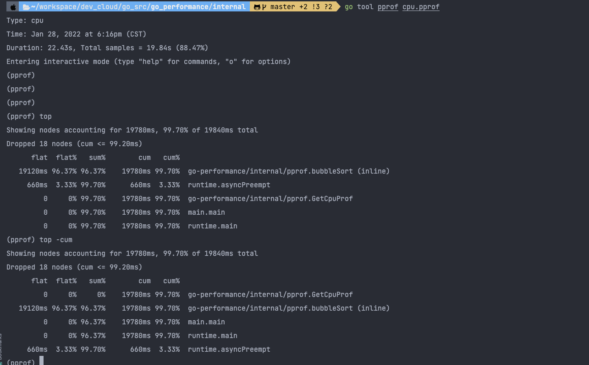
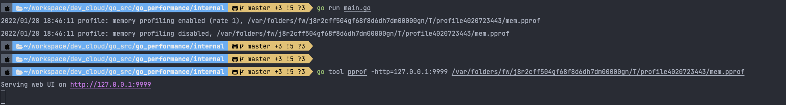
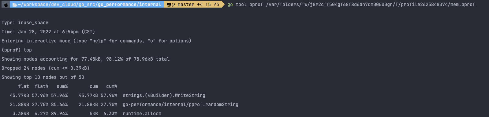
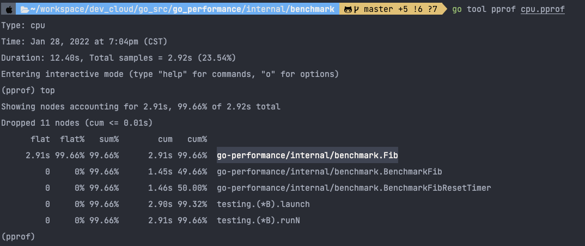

go tool pprof -http=127.0.0.1:9999 cpu.pprof
可以看到 main.bubbleSort 是消耗 CPU 最多的函数。

命令行中使用交互模式查看
go tool pprof cpu.pprof

使用一个易用性更强的库 pkg/profile 来采集性能数据，pkg/profile 封装了 runtime/pprof 的接口，使用起来更简单。
可以看到 concat 消耗了 524k 内存，randomString 仅消耗了 22k 内存。
字符串是不可变的，因为将两个字符串拼接时，相当于是产生新的字符串，
如果当前的空间不足以容纳新的字符串，则会申请更大的空间，将新字符串完全拷贝过去，这消耗了 2 倍的内存空间。
在这 100 次拼接的过程中，会产生多次字符串拷贝，从而消耗大量的内存。
那有什么好的方式呢？使用 strings.Builder 替换 + 进行字符串拼接，将有效地降低内存消耗。

使用strings.Builder 后，concat 内存消耗降为了原来的 1/8

benchmark 生成 profile
testing 支持生成 CPU、memory 和 block 的 profile 文件。
-cpuprofile=$FILE
-memprofile=$FILE, -memprofilerate=N 调整记录速率为原来的 1/N。
-blockprofile=$FILE

使用 -text 选项可以直接将结果以文本形式打印出来。
使用 -png 选项可以直接将结果以图片形式输出。
