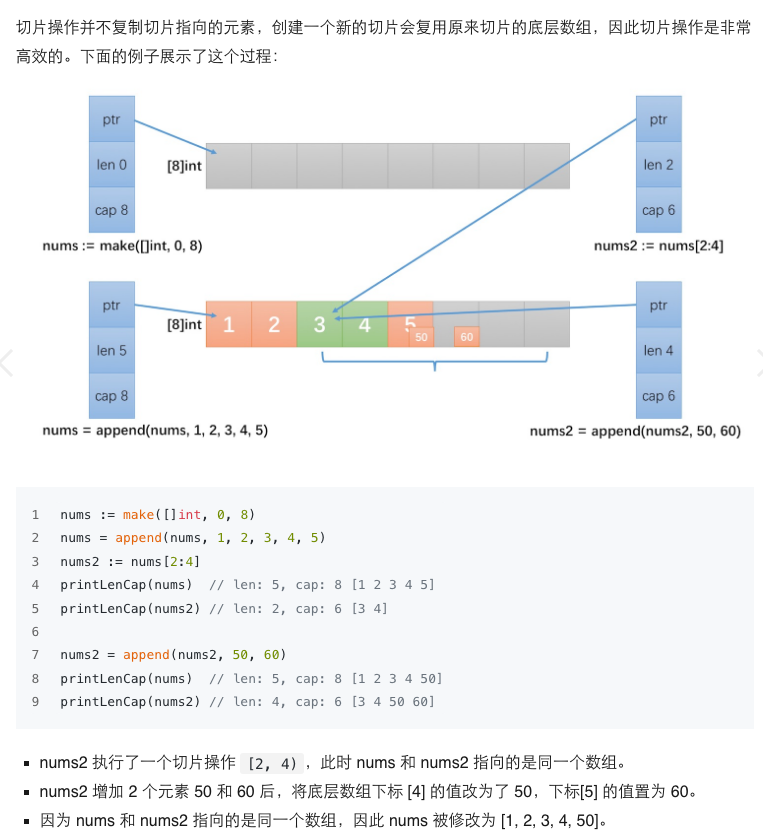

切片类型为处理同类型数据序列提供一个方便而高效的方式。

### 数组
数组类型定义了长度和元素类型。例如， [3]int 类型表示由 3 个 int 整型组成的数组，数组以索引方式访问，例如表达式 s[n] 访问数组的第 n 个元素。数组的长度是固定的，长度是数组类型的一部分。长度不同的 2 个数组是不可以相互赋值的，因为这 2 个数组属于不同的类型。

### 切片
切片使用字面量初始化时和数组很像，但是不需要指定长度。
切片按照下标进行索引。切片本质是一个数组片段的描述，包括了数组的指针，这个片段的长度和容量(不改变内存分配情况下的最大长度)

- https://ueokande.github.io/go-slice-tricks/
- https://github.com/golang/go/wiki/SliceTricks

