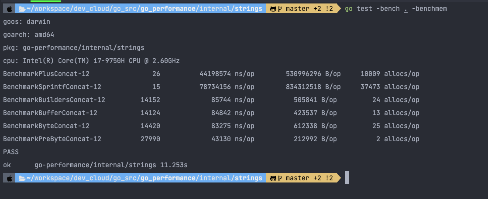
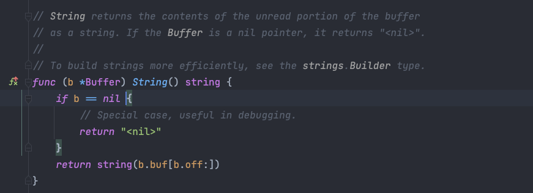

基准测试的结果来看，使用 + 和 fmt.Sprintf 的效率是最低的，和其余的方式相比，性能相差约 1000 倍，而且消耗了超过 1000 倍的内存。
fmt.Sprintf 通常是用来格式化字符串的，一般不会用来拼接字符串。

trings.Builder、bytes.Buffer 和 []byte 的性能差距不大，而且消耗的内存也十分接近，性能最好且消耗内存最小的是 preByteConcat，这种方式预分配了内存，在字符串拼接的过程中，不需要进行字符串的拷贝，也不需要分配新的内存，因此性能最好，且内存消耗最小。
综合易用性和性能，一般推荐使用 strings.Builder 来拼接字符串。

strings.Builder 和 + 性能和内存消耗差距如此巨大，是因为两者的内存分配方式不一样。
字符串在 Go 语言中是不可变类型，占用内存大小是固定的，当使用 + 拼接 2 个字符串时，生成一个新的字符串，那么就需要开辟一段新的空间，新空间的大小是原来两个字符串的大小之和。拼接第三个字符串时，再开辟一段新空间，新空间大小是三个字符串大小之和
strings.Builder，bytes.Buffer，包括切片 []byte 的内存是以倍数申请的。例如，初始大小为 0，当第一次写入大小为 10 byte 的字符串时，则会申请大小为 16 byte 的内存（恰好大于 10 byte 的 2 的指数），第二次写入 10 byte 时，内存不够，则申请 32 byte 的内存，第三次写入内存足够，则不申请新的，以此类推。在实际过程中，超过一定大小，比如 2048 byte 后，申请策略上会有些许调整。
这样会节省非常多的内存空间

strings.Builder 和 bytes.Buffer 底层都是 []byte 数组，但 strings.Builder 性能比 bytes.Buffer 略快约 10% 。一个比较重要的区别在于，bytes.Buffer 转化为字符串时重新申请了一块空间，存放生成的字符串变量，而 strings.Builder 直接将底层的 []byte 转换成了字符串类型返回了回来。

